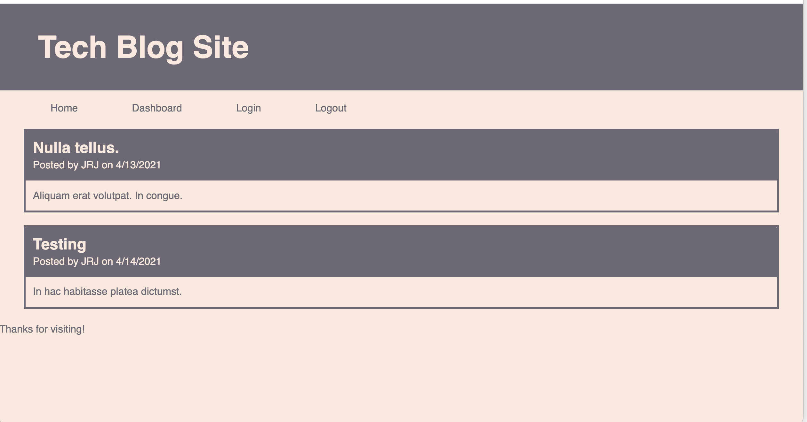

# Tech Blog Site

## Description 

Build a CMS-style blog site similar to a Wordpress site, where developers can publish their blog posts and comment on other developers’ posts as well.

## Table of Contents 

- [Website](#website)
- [Built With](#built-with)
- [Usage](#usage)
- [Contributors](#contributors)

---

## Website

https://mighty-falls-97052.herokuapp.com/

---

## Built With

- Handlebars
- Sequelize
- MySql2
- Express
- JavaScript
- CSS
- HTML

[Back to Contents](#table-of-contents)

---

## Usage

[Back to Contents](#table-of-contents)

---

## Contributors

Jessica Jensen 
[jrjensen14](https://github.com/jrjensen14)

[Back to Contents](#table-of-contents)

